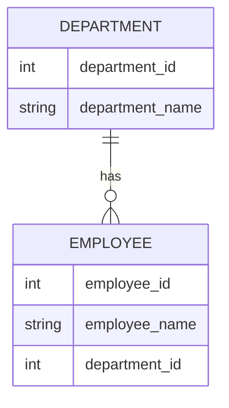

# Logical Data Model - ER Diagram

This diagram shows the relationship between Department and Employee.

```mermaid
erDiagram

    DEPARTMENT ||--o{ EMPLOYEE : has

    DEPARTMENT {
        int department_id
        string department_name
    }

    EMPLOYEE {
        int employee_id
        string employee_name
        int department_id
    }
```
