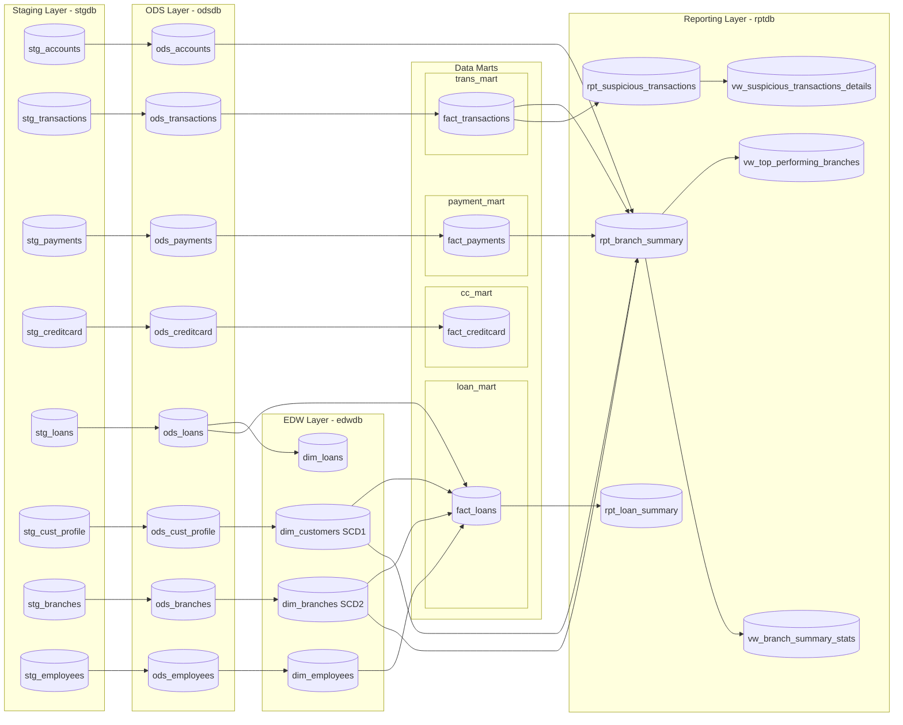

# Banking Physical Data Model - Data Flow Diagram

```mermaid
flowchart LR

subgraph STG["Staging Layer - stgdb"]
    stg_accounts[("stg_accounts")]
    stg_transactions[("stg_transactions")]
    stg_payments[("stg_payments")]
    stg_creditcard[("stg_creditcard")]
    stg_loans[("stg_loans")]
    stg_cust_profile[("stg_cust_profile")]
    stg_branches[("stg_branches")]
    stg_employees[("stg_employees")]
end

subgraph ODS["ODS Layer - odsdb"]
    ods_accounts[("ods_accounts")]
    ods_transactions[("ods_transactions")]
    ods_payments[("ods_payments")]
    ods_creditcard[("ods_creditcard")]
    ods_loans[("ods_loans")]
    ods_cust_profile[("ods_cust_profile")]
    ods_branches[("ods_branches")]
    ods_employees[("ods_employees")]
end

subgraph EDW["EDW Layer - edwdb"]
    dim_customers[("dim_customers SCD1")]
    dim_branches[("dim_branches SCD2")]
    dim_employees[("dim_employees")]
    dim_loans[("dim_loans")]
end

subgraph trans_mart["trans_mart"]
    fact_transactions[("fact_transactions")]
end

subgraph payment_mart["payment_mart"]
    fact_payments[("fact_payments")]
end

subgraph cc_mart["cc_mart"]
    fact_creditcard[("fact_creditcard")]
end

subgraph loan_mart["loan_mart"]
    fact_loans[("fact_loans")]
end

subgraph MARTS["Data Marts"]
    trans_mart
    payment_mart
    cc_mart
    loan_mart
end

subgraph REPORT["Reporting Layer - rptdb"]
    rpt_branch_summary[("rpt_branch_summary")]
    vw_top_performing[("vw_top_performing_branches")]
    rpt_suspicious_txn[("rpt_suspicious_transactions")]
    vw_branch_stats[("vw_branch_summary_stats")]
    vw_suspicious_details[("vw_suspicious_transactions_details")]
    rpt_loan_summary[("rpt_loan_summary")]
end

stg_accounts --> ods_accounts
stg_transactions --> ods_transactions
stg_payments --> ods_payments
stg_creditcard --> ods_creditcard
stg_loans --> ods_loans
stg_cust_profile --> ods_cust_profile
stg_branches --> ods_branches
stg_employees --> ods_employees

ods_cust_profile --> dim_customers
ods_branches --> dim_branches
ods_employees --> dim_employees
ods_loans --> dim_loans

ods_transactions --> fact_transactions
ods_payments --> fact_payments
ods_creditcard --> fact_creditcard
ods_loans --> fact_loans

dim_branches --> fact_loans
dim_customers --> fact_loans
dim_employees --> fact_loans

dim_branches --> rpt_branch_summary
dim_customers --> rpt_branch_summary
ods_accounts --> rpt_branch_summary
fact_payments --> rpt_branch_summary
fact_transactions --> rpt_branch_summary
fact_transactions --> rpt_suspicious_txn
fact_loans --> rpt_loan_summary

rpt_branch_summary --> vw_top_performing
rpt_branch_summary --> vw_branch_stats
rpt_suspicious_txn --> vw_suspicious_details
```
